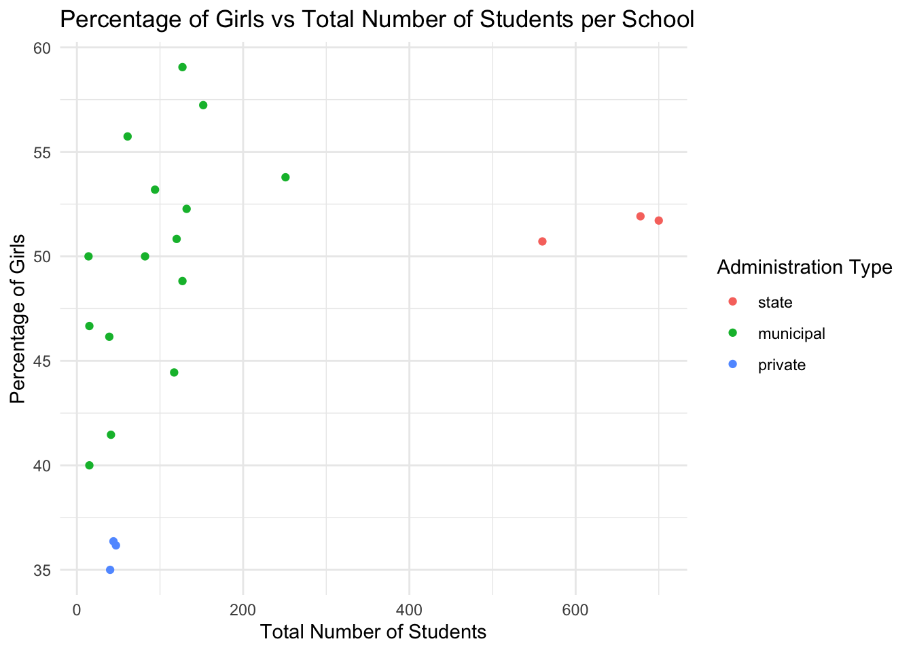
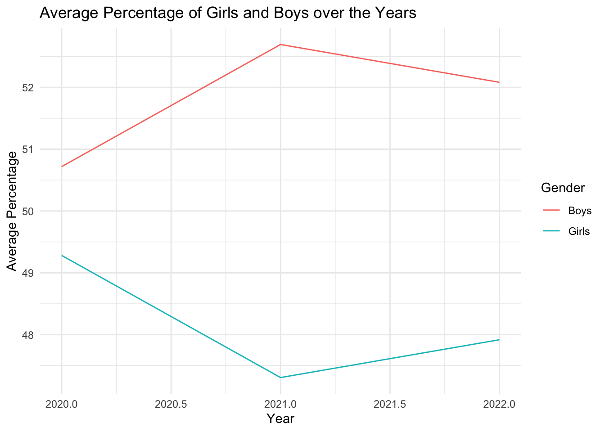
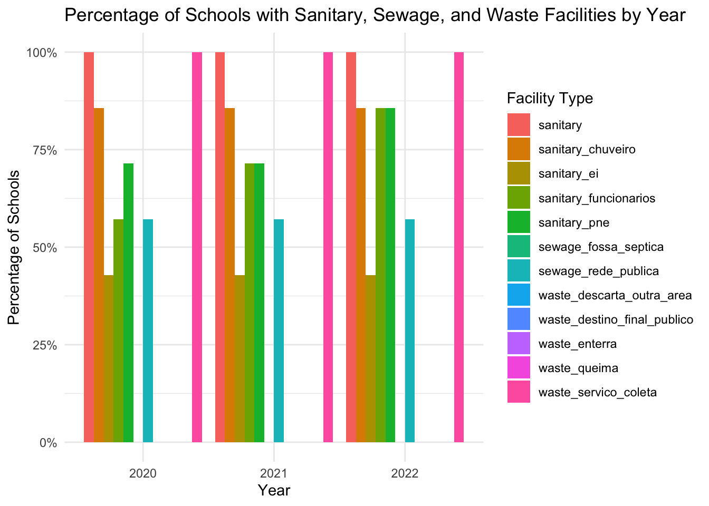
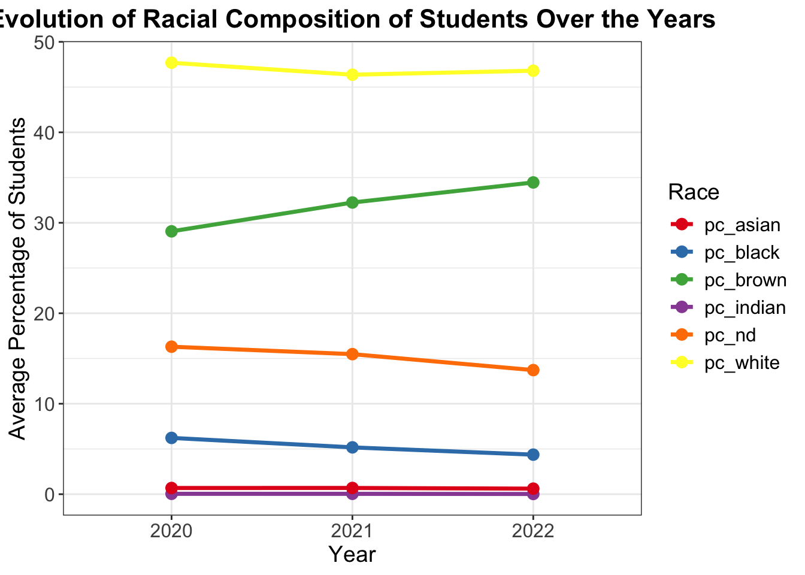
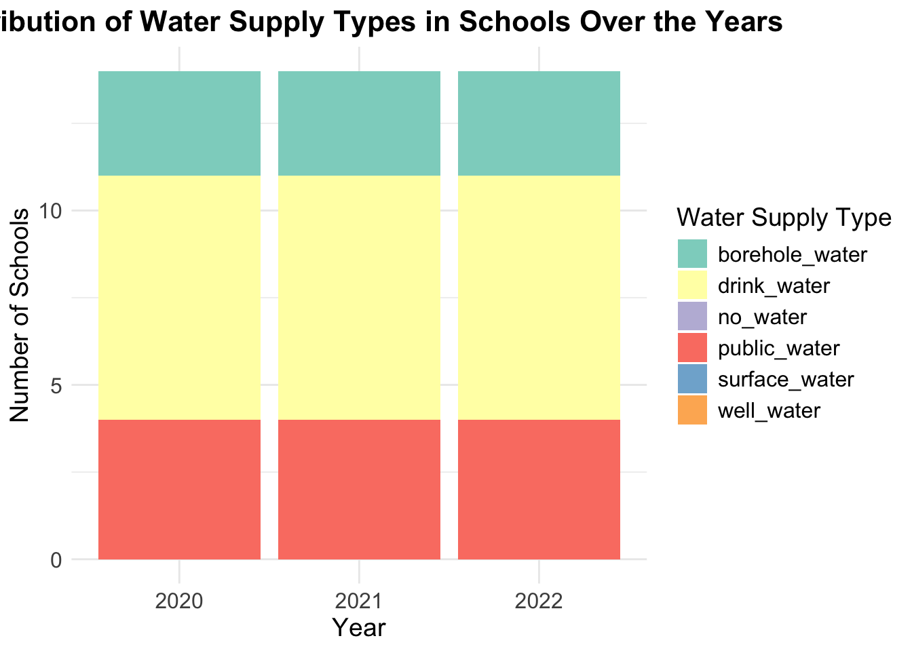

# waschoolpiracema

The goal of `waschoolpiracema` is to describe the profile of schools
from the basic education system in the municipality of Piracema (Minas
Gerais, Brazil). Moreover, the data compare the characteristics of
schools, with a special concern to WASH, pre- (2020), peri- (2021) and
post-COVID-19 pandemic (2022) to evaluate to what extend schools in
Piracema made progress in providing WASH since the beginning of the
COVID-19 pandemic.

## Installation

You can install the development version of waschoolpiracema from
[GitHub](https://github.com/) with:

``` r

# install.packages("devtools")
devtools::install_github("openwashdata/waschoolpiracema")
```

``` r

## Run the following code in console if you don't have the packages
## install.packages(c("dplyr", "knitr", "readr", "stringr", "gt", "kableExtra"))
library(dplyr)
library(knitr)
library(readr)
library(stringr)
library(gt)
library(kableExtra)
```

Alternatively, you can download the individual datasets as a CSV or XLSX
file from the table below.

| dataset | CSV | XLSX |
|:---|:---|:---|
| waschoolpiracema | [Download CSV](https://github.com/openwashdata/waschoolpiracema/raw/main/inst/extdata/waschoolpiracema.csv) | [Download XLSX](https://github.com/openwashdata/waschoolpiracema/raw/main/inst/extdata/waschoolpiracema.xlsx) |

## Data

The municipality of Piracema is located in the southeast region of
Brazil, in the state of Minas Gerais. Piracema is a small size city
adding up to 6,700 inhabitants (IBGE, 2023). Among all Brazilian
territories, it ranks as the 3,734º smallest municipality out of 5,570
and in Minas Gerais it ranks as the 492º out of 853 (IBGE, 2023).

Piracema is located approximately 120 km away from the capital of its
state (Belo Horizonte), and it is inaccessible by public transportation
(IBGE, 2023). Piracema will be the study area for the next phase of the
research (collection of primary data).

``` r

library(waschoolpiracema)
```

### waschoolpiracema

The dataset `waschoolpiracema` contains data about the water supply, the
sewage disposal, the waste collection and the sanitary equipment of the
schools in Piracema. It also provides information about gender, race and
education levels of the school’s students. It has 21 observations and 36
variables

``` r

waschoolpiracema |> 
  head(3) |> 
  gt::gt() |>
  gt::as_raw_html()
```

| year | sch_id | admin | loc | drink_water | public_water | borehole_water | well_water | surface_water | no_water | sewage_rede_publica | sewage_fossa_septica | waste_servico_coleta | waste_queima | waste_enterra | waste_destino_final_publico | waste_descarta_outra_area | sanitary | sanitary_ei | sanitary_pne | sanitary_funcionarios | sanitary_chuveiro | qt_mat_bas | pc_girl | pc_boy | pc_white | pc_brown | pc_black | pc_indian | pc_asian | pc_nd | pc_cre | pc_pre | pc_prim_1 | pc_prim_2 | pc_sec |
|---:|---:|:--:|:--:|:--:|:--:|:--:|:--:|:--:|:--:|:--:|:--:|:--:|:--:|:--:|:--:|:--:|:--:|:--:|:--:|:--:|:--:|---:|---:|---:|---:|---:|---:|---:|---:|---:|---:|---:|---:|---:|---:|
| 2020 | 31035386 | state | urban | TRUE | TRUE | FALSE | FALSE | FALSE | FALSE | TRUE | FALSE | TRUE | FALSE | FALSE | FALSE | FALSE | TRUE | FALSE | FALSE | TRUE | FALSE | 678 | 51.91740 | 48.08260 | 45.13274 | 41.445428 | 10.324484 | 0.2949853 | 0.2949853 | 2.507375 | 0 | 0 | 22.56637 | 39.67552 | 32.15339 |
| 2020 | 31039918 | municipal | rural | TRUE | FALSE | TRUE | FALSE | FALSE | FALSE | FALSE | FALSE | TRUE | FALSE | FALSE | FALSE | FALSE | TRUE | FALSE | TRUE | TRUE | TRUE | 14 | 50.00000 | 50.00000 | 42.85714 | 7.142857 | 0.000000 | 0.0000000 | 0.0000000 | 50.000000 | 0 | 0 | 100.00000 | 0.00000 | 0.00000 |
| 2020 | 31039926 | municipal | rural | TRUE | FALSE | TRUE | FALSE | FALSE | FALSE | FALSE | FALSE | TRUE | FALSE | FALSE | FALSE | FALSE | TRUE | FALSE | TRUE | FALSE | TRUE | 127 | 59.05512 | 40.94488 | 45.66929 | 25.984252 | 2.362205 | 0.0000000 | 1.5748031 | 24.409449 | 0 | 0 | 100.00000 | 0.00000 | 0.00000 |

For an overview of the variable names, see the following table.

| variable_name | variable_type | description |
|:---|:---|:---|
| year | double | Year of Survey |
| sch_id | double | Numerical code of the school |
| admin | factor | The administration of the school is federal (1); state (2); municipal (3), or private (4). Federal, state, and municipal schools are considered public. |
| loc | factor | The school is located in an urban (1) or rural area (2) |
| drink_water | logical | The school provides drinking water with quality suitable for human consumption (i.e., ingestion, preparation, and production of food) according to the Brazilian national water quality standards (former Portaria nº 2.914/2011 now Portaria de Consolidação nº5/2017) |
| public_water | logical | The water in the school is supplied by a public network . |
| borehole_water | logical | The water in the school is supplied by a borehole |
| well_water | logical | The water in the school is supplied by a cacimba, cistern, or well |
| surface_water | logical | The water in the school is supplied by surface water source |
| no_water | logical | There is no water supply in the school |
| sewage_rede_publica | logical | The school dispose their sewage into a public sewerage system |
| sewage_fossa_septica | logical | The school dispose their sewage into septic tank |
| waste_servico_coleta | logical | The solid waste in the school is regularly collected by the public cleaning service |
| waste_queima | logical | The solid waste in the school is burned or incinerated |
| waste_enterra | logical | The solid waste in the school is buried |
| waste_destino_final_publico | logical | The solid waste in the school is disposed in an area licensed by environmental agencies, intended to receive solid waste in a planned manner (e.g., landfills) |
| waste_descarta_outra_area | logical | The solid waste in the school is disposed in another area (none of the other options) |
| sanitary | logical | The school is equipped with sanitary facilities for personal hygiene/physiological needs |
| sanitary_ei | logical | The school is equipped with sanitary facilities for children 0 to 5 years old |
| sanitary_pne | logical | The school is equipped with disability-friendly sanitary facilities following the national guidelines (ABNT - NBR 9050) |
| sanitary_funcionarios | logical | The school is equipped with sanitary facilities for personal hygiene/physiological needs exclusively for staff |
| sanitary_chuveiro | logical | The school is equipped with sanitary facilities or changing room or washing room with appropriate equipment (shower) for bathing, exclusively for students |
| qt_mat_bas | double | Total number of students per school |
| pc_girl | double | Percentage of girls per school |
| pc_boy | double | Percentage of boys per school |
| pc_white | double | Percentage of students that are classified or self-identified as white race/skin color per school |
| pc_brown | double | Percentage of students that are classified or self-identified as brown race/skin color per school |
| pc_black | double | Percentage of students that are classified or self-identified as black race/skin color per school |
| pc_indian | double | Percentage of students that are classified or self-identified as indigenous race/skin color per school |
| pc_asian | double | Percentage of students that are classified or self-identified as Asian race/skin color per school |
| pc_nd | double | Percentage of students that did not declared race/skin color per school |
| pc_cre | double | Percentage of students in daycare (0 - 3 years old) |
| pc_pre | double | Percentage of students in preschool (4 - 5 years old) |
| pc_prim_1 | double | Percentage of students in primary education first cycle (6 - 10 years old) |
| pc_prim_2 | double | Percentage of students in primary education second cycle (11 - 14 years old) |
| pc_sec | double | Percentage of students in secondary education (15 - 18 years old) |

## Examples

``` r

# Load necessary libraries
library(waschoolpiracema)
library(ggplot2)
library(dplyr)
library(tidyr)

# Load the dataset
load("data/waschoolpiracema.rda")

# admin is already a factor with the labels federal, state, municipal and private
# Create the plot
ggplot(waschoolpiracema, aes(x = qt_mat_bas, y = pc_girl, color = admin)) +
  geom_point() +
  labs(title = "Percentage of Girls vs Total Number of Students per School",
       x = "Total Number of Students",
       y = "Percentage of Girls",
       color = "Administration Type") +
  theme_minimal()
```



``` r

# Summarize the data to get average percentages per year
summary_data <- waschoolpiracema %>%
  group_by(year) %>%
  summarise(avg_pc_girl = mean(pc_girl, na.rm = TRUE),
            avg_pc_boy = mean(pc_boy, na.rm = TRUE))

# Create the plot
ggplot(summary_data, aes(x = year)) +
  geom_line(aes(y = avg_pc_girl, color = "Girls")) +
  geom_line(aes(y = avg_pc_boy, color = "Boys")) +
  labs(title = "Average Percentage of Girls and Boys over the Years",
       x = "Year",
       y = "Average Percentage",
       color = "Gender") +
  theme_minimal()
```



``` r

# List of columns related to sanitary, sewage, and waste facilities
sanitary_sewage_waste_cols <- c(
  "sanitary", "sanitary_ei", "sanitary_pne", "sanitary_funcionarios", "sanitary_chuveiro",
  "sewage_rede_publica", "sewage_fossa_septica",
  "waste_servico_coleta", "waste_queima", "waste_enterra", "waste_destino_final_publico", "waste_descarta_outra_area"
)

# Convert relevant columns to integers
waschoolpiracema[sanitary_sewage_waste_cols] <- lapply(waschoolpiracema[sanitary_sewage_waste_cols], function(x) as.integer(x))

# Summarize the waschoolpiracema data to get the count and percentage of schools with facilities per year
summary_data <- waschoolpiracema %>%
  group_by(year) %>%
  summarise(across(all_of(sanitary_sewage_waste_cols), ~ mean(.x, na.rm = TRUE))) %>%
  pivot_longer(cols = sanitary_sewage_waste_cols, names_to = "facility", values_to = "percentage")

# Create the plot
ggplot(summary_data, aes(x = factor(year), y = percentage, fill = facility)) +
  geom_bar(stat = "identity", position = "dodge") +
  labs(title = "Percentage of Schools with Sanitary, Sewage, and Waste Facilities by Year",
       x = "Year",
       y = "Percentage of Schools",
       fill = "Facility Type") +
  theme_minimal() +
  scale_y_continuous(labels = scales::percent)
```



``` r

# List of columns related to race
race_cols <- c("pc_white", "pc_brown", "pc_black", "pc_indian", "pc_asian", "pc_nd")

# Summarize the waschoolpiracema data to get the average percentage of students per race per year
summary_data <- waschoolpiracema %>%
  group_by(year) %>%
  summarise(across(all_of(race_cols), ~ mean(.x, na.rm = TRUE))) %>%
  pivot_longer(cols = race_cols, names_to = "race", values_to = "percentage")

# Create the line plot
ggplot(summary_data, aes(x = factor(year), y = percentage, color = race, group = race)) +
  geom_line(size = 1.2) +
  geom_point(size = 3) +
  labs(title = "Evolution of Racial Composition of Students Over the Years",
       x = "Year",
       y = "Average Percentage of Students",
       color = "Race") +
  theme_bw() +  # Use a different theme for better visualization
  theme(
    plot.title = element_text(hjust = 0.5, size = 16, face = "bold"),
    axis.title = element_text(size = 14),
    axis.text = element_text(size = 12),
    legend.title = element_text(size = 14),
    legend.text = element_text(size = 12)
  ) +
  scale_color_brewer(palette = "Set1")
```



``` r

water_cols <- c("drink_water", "public_water", "borehole_water", "well_water", "surface_water", "no_water")

# Convert relevant columns to integers
waschoolpiracema[water_cols] <- lapply(waschoolpiracema[water_cols], function(x) as.integer((x)))

# Summarize the data to get the count and percentage of schools with each type of water supply per year
summary_data <- waschoolpiracema %>%
  group_by(year) %>%
  summarise(across(all_of(water_cols), ~ sum(.x, na.rm = TRUE))) %>%
  pivot_longer(cols = water_cols, names_to = "water_supply", values_to = "count")

# Create the stacked bar plot
ggplot(summary_data, aes(x = factor(year), y = count, fill = water_supply)) +
  geom_bar(stat = "identity") +
  labs(title = "Distribution of Water Supply Types in Schools Over the Years",
       x = "Year",
       y = "Number of Schools",
       fill = "Water Supply Type") +
  theme_minimal() +
  theme(
    plot.title = element_text(hjust = 0.5, size = 16, face = "bold"),
    axis.title = element_text(size = 14),
    axis.text = element_text(size = 12),
    legend.title = element_text(size = 14),
    legend.text = element_text(size = 12)
  ) +
  scale_fill_brewer(palette = "Set3")
```



## Capstone Project

This dataset is shared as part of a capstone project in [Data Science
for openwashdata](https://ds4owd-001.github.io/website/). For more
information about the project and to explore further insights, please
visit the project page at
<https://ds4owd-001.github.io/project-poaguek/> (to be public available)

This study is a sub-project of a PhD project. It is also an initial
study comparing the BNSC from 2020 and 2021(#TODO: add reference).
Findings will be essential for the next phase of the research, which
will be the collection of primary data in schools in the municipality of
Piracema through qualitative methods (interviews, on-spot observations
and art-based research).

## License

Data are available as
[CC-BY](https://github.com/openwashdata/waschoolpiracema/blob/main/LICENSE.md).

## Citation

Please cite this package using:

``` r

citation("waschoolpiracema")
#> To cite package 'waschoolpiracema' in publications use:
#> 
#>   Tabin A, Poague K, Zhong M (2024). "waschoolpiracema: WASH in Schools
#>   in Piracema, Brazil." doi:10.5281/zenodo.12701106
#>   <https://doi.org/10.5281/zenodo.12701106>.
#>   <https://github.com/openwashdata/waschoolpiracema>.
#> 
#> A BibTeX entry for LaTeX users is
#> 
#>   @Misc{tabin_etall:2024,
#>     title = {waschoolpiracema: WASH in Schools in Piracema, Brazil},
#>     author = {Alexis Tabin and Kasandra Poague and Mian Zhong},
#>     year = {2024},
#>     doi = {10.5281/zenodo.12701106},
#>     url = {https://github.com/openwashdata/waschoolpiracema},
#>     abstract = {The main goal of this study was to describe the profile of schools from the basic education system in the municipality of Piracema (Minas Gerais, Brazil). Moreover, we also aimed to compare the characteristics of schools, with a special concern to WASH, pre- (2020), peri- (2021) and post-COVID-19 pandemic (2022) to evaluate to what extend schools in Piracema made progress in providing WASH since the beginning of the COVID-19 pandemic. This study is a sub-project of a PhD project and an initial study comparing the BNSC from 2020 and 2021 has already been conducted and published by the author of this project (for more details see references). Findings will be essential for the next phase of the research, which will be the collection of primary data in schools in the municipality of Piracema through qualitative methods (interviews, on-spot observations and art-based research).},
#>     keywords = {open data,washdata,WASH in schools,water supply,sanitation,solid waste,school census,Piracema,Minas Gerais,Brazil,brazil,opendata,openwashdata,piracema,r,wash},
#>     version = {0.0.1},
#>   }
```
